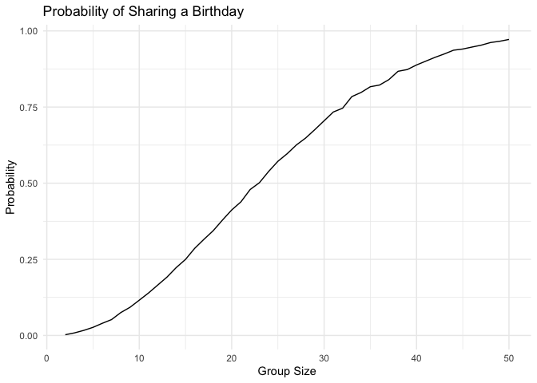

p8105_hw5_sw3455
================
Shiying Wu
2024-11-13

``` r
birthday = function(n) {
  bdays = sample(1:365, size = n, replace = TRUE)
  duplicate = length(unique(bdays)) < n           
  return(duplicate)
}

output <- vector("list", 49)

for (i in 2:50) {
  results <- 0 
  for (j in 1:10000){
  if (birthday(i)) {results = results + 1}
  }
  output[[i - 1]] <- tibble(size = i, prob = results / 10000)
}

bind_rows(output)|>
  ggplot(aes(x = size, y = prob)) +
  geom_line() +
  labs(title = "Probability of Sharing a Birthday",
       x = "Group Size",
       y = "Probability") +
  theme_minimal()
```

<!-- --> As number
of people increase, the probability also increases exponentially.
Surprisingly when there’s 50 people in the room, the probability is
almost 1.

``` r
ttest = function(mu) {
  ttest_output <- vector("list", 5000)
  for (i in 1:5000) {
  data <- rnorm(30, mean = mu, sd = 5)
  table <- t.test(data, mu = 0)|>
    broom::tidy() |>
    select(estimate, p.value)
  ttest_output[[i]] <- tibble(mu = mu, table)
  }
  return(bind_rows(ttest_output))
}

ttest_output <- vector("list", 7)
for (i in 0:6) {
    ttest_output[[i+1]] <- ttest(i)}
ttest_result <- bind_rows(ttest_output)
```

``` r
ttest_result |>
  group_by(mu) |>
  summarise(power = mean(p.value < 0.05)) |>
  ggplot(aes(x = mu, y = power)) +
  geom_point() +
  geom_line() +
  labs(x = "Mu",
       y = "Power") +
  theme_minimal()
```

<!-- --> As
the effect size increases (meaning the true mean mu be larger away from
the null hypothesis mean 0), the power of the test increases(higher
proportion of rejection) exponentialy. As true mean reach more than 4,
the rejection more and more close to 1.

``` r
ttest_result |>
  group_by(mu) |>
  summarise(Sample_Mean = mean(estimate)) |>
  ggplot(aes(x = mu, y = Sample_Mean)) +
  geom_point() +
  geom_line() +
  labs(x = "Mu",
       y = "Sample Mean") +
  theme_minimal()
```

<!-- -->

``` r
ttest_result |>
  filter(p.value < 0.05) |>
  group_by(mu) |>
  summarise(Sample_Mean = mean(estimate)) |>
  ggplot(aes(x = mu, y = Sample_Mean)) +
  geom_point() +
  geom_line() +
  labs(x = "Mu",
       y = "Sample Mean") +
  theme_minimal()
```

<!-- -->
On the plot 2, mean of each 5000 sample mean is really close to their
true mean. Compare to plot 3 for the rejected sample it is significantly
more or less then their true mean as line is not a straight line before
4, however, after 4, the sample mean are similar to their ture mean and
similar line as plot 2.

``` r
homicides = read.csv("./data/homicide-data.csv",
        na = c(".", "NA", "")) |>
  janitor::clean_names() 
```

The data has have 12 columns which means have 12 variables and 52179
rows means 52179 criminal homicides. The 12 variables are uid,
reported_date, victim_last, victim_first, victim_race, victim_age,
victim_sex, city, state, lat, lon, disposition. It including date and
location for the homicides, geograophic imformation about victim and
situation of homicides whether it is closed or still open.

``` r
homicide_df <- homicides |>
  mutate(city_state = paste(city, state, sep = ", ")) |>
  filter(city_state != "Tulsa, AL") |>
  group_by(city_state) |>
  summarise(
    total_homicides = n(),
    unsolved_homicides = sum(disposition %in% c("Closed without arrest", "Open/No arrest"))
  )
```

There is only one cases in Tulsa, AL, and after googling, there is no
Tulsa city in AL which count as a mistake

``` r
proptest = function(unsolved_homicides, total_homicides) {
  prop_test = prop.test(unsolved_homicides, total_homicides) |>
  broom::tidy(prop_test) |>
  select(estimate, conf.low, conf.high)
  return(tibble(prop_test))
}

Baltimore_df <- homicide_df |>
  filter(city_state == "Baltimore, MD")

Baltimore_result <-
  proptest(Baltimore_df$unsolved_homicides, Baltimore_df$total_homicides)
```

``` r
overall_results =
  homicide_df |>
  mutate(results = purrr::map2(unsolved_homicides, total_homicides, proptest)) |>
  unnest(results)|>
  select(city_state, estimate, conf.low, conf.high)
```

``` r
overall_results|>
  arrange(desc(estimate))|>
  ggplot(aes(x = fct_reorder(city_state, estimate), y = estimate)) +
  geom_point() +
  geom_errorbar(aes(ymin = conf.low, ymax = conf.high), width = 0.5) +
  coord_flip() + 
  labs(x = "City",
       y = "Proportion of Unsolved Homicides") +
  theme_minimal() +
  theme(axis.text.y = element_text(size = 11))
```

<!-- -->
